# SuperAI Agent 桌面端 — 快速上手

> 一个应用，两种身份：**Work** 模式帮办公用户处理文档、表格、PPT、日程和邮件；**Code** 模式给开发者构建、调试、交付软件。任意 Anthropic 兼容模型即可驱动。

[界面布局](#一界面布局) · [Work / Code 模式](#二work--code-模式) · [对话操作](#三对话操作) · [多标签](#四多标签系统) · [权限控制](#五权限控制) · [项目目录](#六项目目录) · [模型与服务商](#七模型与服务商) · [MCP 与连接器](#八mcp-与职场连接器) · [IM 接入](#九im-适配器接入) · [定时任务](#十定时任务) · [Computer Use](#十一computer-use) · [应用更新](#十二应用更新) · [快捷键](#十三键盘快捷键速查) · [主题与语言](#十四主题与语言)

---

## 一、界面布局

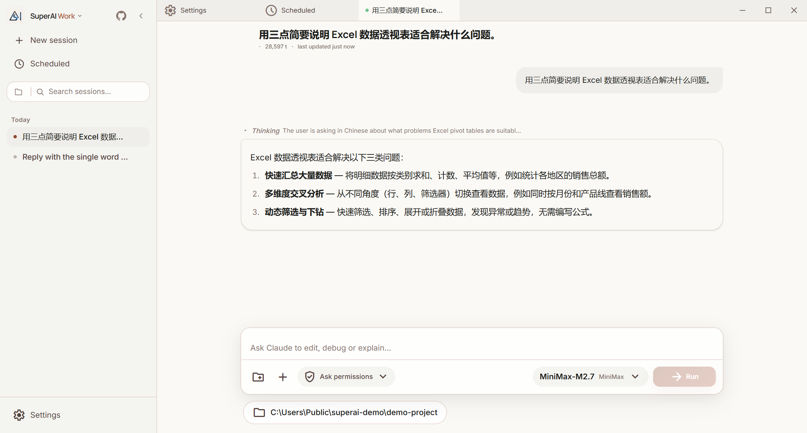

窗口分为三块：

```
┌──────────────┬────────────────────────────────────────────┐
│ SuperAI Work▾│ [Settings] [Scheduled] [● 会话标签] …        │  ← 标签栏
│ + New session├────────────────────────────────────────────┤
│ ◷ Scheduled  │                                            │
│ 🔍 搜索会话   │              当前标签的内容                  │
│ 今天          │        （对话 / 设置 / 定时任务）             │
│  • 会话 A     │                                            │
│  • 会话 B     ├────────────────────────────────────────────┤
│              │  [输入框]  📁 ＋  权限模式▾   模型▾  ▶ Run    │
│ ⚙ Settings   │  📂 C:\path\to\project                     │  ← 工作目录
└──────────────┴────────────────────────────────────────────┘
```

### 侧边栏

- **品牌 / 模式开关**：`SuperAI Work ▾` / `SuperAI Code ▾`，点击切换模式（见下一节）
- **New session**：新建会话（`Cmd/Ctrl + N`）
- **Scheduled**：定时任务页面
- **搜索框**：按标题过滤会话；左侧文件夹图标按项目筛选
- **会话列表**：按「今天 / 昨天 / 最近 7 天 / 最近 30 天 / 更早」分组，运行中的会话前有彩色圆点；右键可重命名 / 删除
- **Settings**：设置页（服务商、权限、通用、IM 接入、终端、MCP、Agents、技能、插件、Computer Use、关于）
- 左上角 `<` 折叠侧边栏

### 输入区

输入框下方一排控件：📁 选择工作目录 · `+` 添加附件 · **权限模式**下拉（Ask permissions / Accept edits / Plan mode / Bypass all）· **模型**下拉（当前服务商的模型）· **Run** 发送。再下方的文件夹芯片显示当前会话的工作目录。

---

## 二、Work / Code 模式

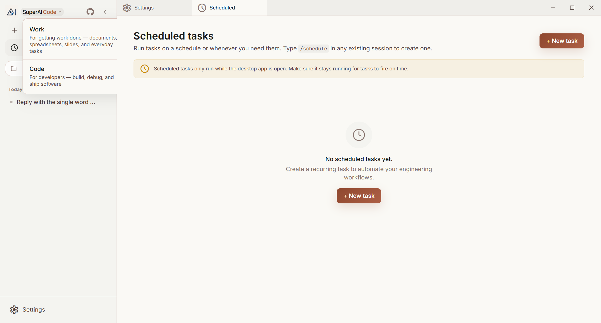

点击侧边栏顶部的品牌名打开下拉：

| 模式 | 面向 | 特点 |
|------|------|------|
| **Work** | 普通办公用户 | 面向文档、表格、PPT、邮件、日程等日常任务；内置 **Assistant**（收件箱 / 日历 / 会议）、**Sales**（客户 / 跟进 / CRM）、**Analyst**（表格 / 周期报表）和 **office**（文档生成与转换）等职场角色；对会改变外部系统的 MCP 操作（发送、创建、删除…）**强制弹出确认** |
| **Code** | 开发者 | 完整的编码代理：Bash / 文件读写 / Git / 多 Agent 编排 / 技能与插件 |

- 模式选择会记住；**每个会话在创建时打上模式标记**，切换模式不影响已有会话
- Work 模式的角色和连接器目录是 `~/.superai/` 下的普通文件，可以直接编辑或增删（首次启动自动写入默认内容）
- 两种模式共用同一套服务商、会话存储与设置


---

## 三、对话操作

### 新建会话

1. 点击 **New session**（或 `Cmd/Ctrl + N`）
2. 在输入框下方的文件夹芯片里选择**工作目录**：「Recent」列出最近用过的项目，「Choose a different folder」打开系统文件夹对话框
3. 输入第一条消息，按 **Enter** 或点 **Run**

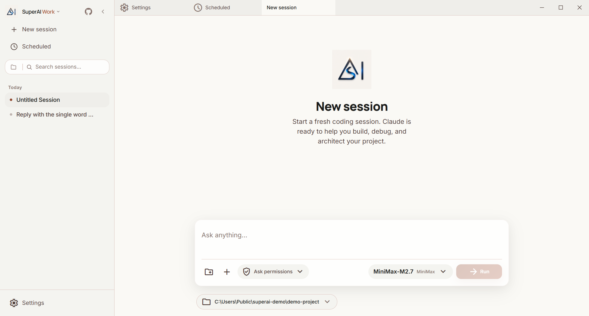

### 发送消息

- **Enter** 发送，**Shift + Enter** 换行
- 输入框随内容自动增高
- 生成过程中 **Run** 变为 **Stop**（或 `Cmd/Ctrl + .`）随时中断

### 附件

| 方式 | 操作 |
|------|------|
| 粘贴图片 | 输入框中 `Cmd/Ctrl + V` |
| 拖拽 | 把文件拖进输入区域 |
| 文件选择 | 点 `+` → 添加文件 |

附件在输入框上方以缩略图展示，可预览、移除。

### 斜杠命令

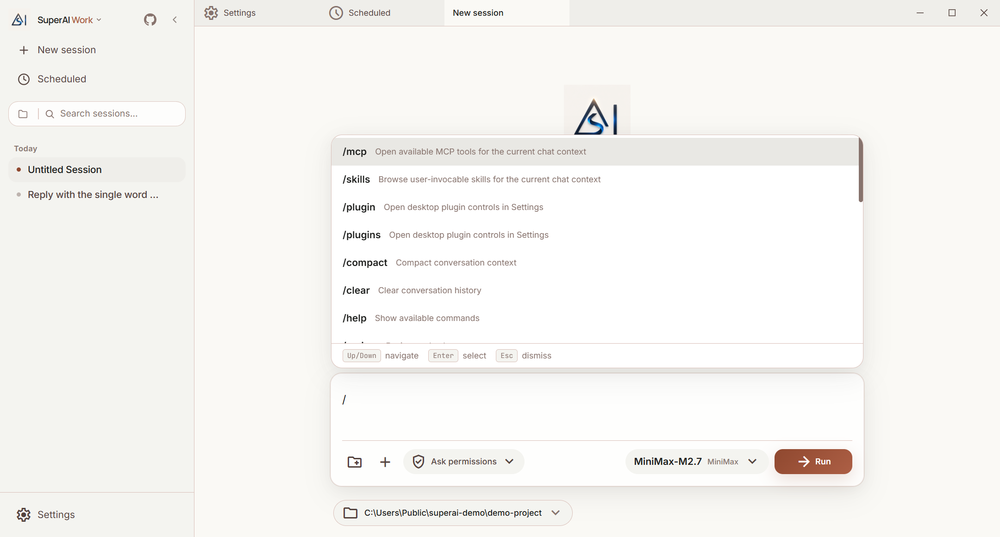

输入 `/` 弹出命令菜单（上下键选择、Enter 确认、Esc 关闭，支持边输入边过滤）。常用：

| 命令 | 作用 |
|------|------|
| `/compact` | 压缩上下文，保留摘要以节省 token |
| `/clear` | 清空当前会话历史 |
| `/mcp` | 查看当前会话可用的 MCP 工具 |
| `/skills` | 浏览可调用的技能 |
| `/plugin` `/plugins` | 打开插件设置 |
| `/schedule` | 把当前对话变成一个定时任务 |
| `/help` | 列出全部命令 |

命令列表由服务端动态提供，安装的技能 / 插件会追加自己的命令。

### @ 文件引用

输入 `@` 后接文件名片段，弹出当前工作目录的文件搜索，Enter 把文件附加进上下文。

### 消息类型

| 类型 | 展示 |
|------|------|
| 用户消息 | 右侧灰色气泡 |
| 助手回复 | 左侧带边框气泡，Markdown / 代码高亮 / Mermaid 渲染 |
| Thinking | 可展开的推理摘要 |
| 工具调用 | 工具名 + 参数摘要，可展开看输入与输出（Read / Bash / Edit / Glob …） |
| 权限请求 | 卡片式对话框，含允许 / 拒绝按钮 |
| AskUser | AI 向你提问时出现的选择框 |

会话标题在第一轮回复后自动生成，也可以在侧边栏右键 **重命名**。

---

## 四、多标签系统

标签栏像浏览器一样管理多个会话与页面：

| 操作 | 方式 |
|------|------|
| 新建标签 | `Cmd/Ctrl + N` 或点 **New session** |
| 切换 / 关闭 | 点击标签 / 悬浮后点 `×` |
| 拖拽排序 | 按住标签拖动 |
| 右键菜单 | 关闭当前 / 其他 / 左侧 / 右侧 / 全部 |

- 标签前的圆点：**彩色脉冲** = 运行中，**红色** = 出错
- 关闭一个**正在运行**的会话会先弹确认（继续运行 / 停止并关闭 / 取消）
- 打开的标签保存在本地，下次启动恢复

---

## 五、权限控制

AI 在执行文件修改、Shell 命令、外部操作前会请求你的许可。

### 权限请求对话框

弹出卡片显示工具类型（如 Bash、Edit、Write）、操作预览（命令内容、Diff）、可展开的详细参数，按钮：**允许**（仅本次）/ **一直允许**（本会话内同类操作）/ **拒绝**。

### 四种权限模式

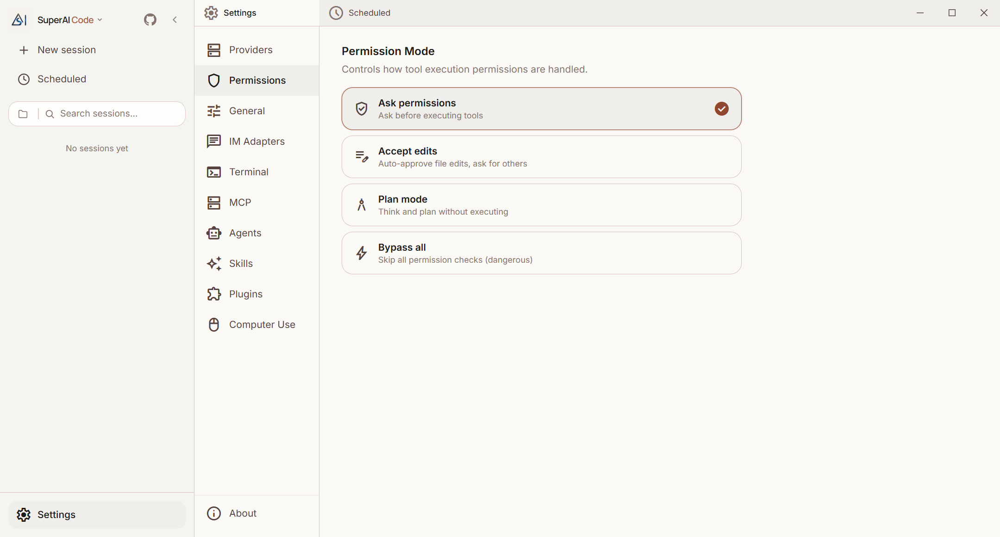

在输入区的权限下拉或 **设置 → 权限** 中切换：

| 模式 | 说明 |
|------|------|
| **Ask permissions**（默认） | 每个操作都确认 |
| **Accept edits** | 自动允许文件编辑，其余仍询问 |
| **Plan mode** | 只思考和规划，不执行 |
| **Bypass all** | 全部自动执行（危险，需二次确认） |

> Work 模式额外规则：无论权限模式如何，会对外部系统产生副作用的 MCP 调用（发消息、建日程、删文件…）都会弹出确认。

---

## 六、项目目录

每个会话绑定一个**工作目录**（本地项目文件夹），显示在输入区下方的芯片里。

- 会话开始前可以随时更换目录；开始对话后目录固定，芯片变为「项目上下文」显示仓库名和分支
- 侧边栏搜索框左侧的文件夹按钮可按项目**筛选**会话
- 「Recent」列表来自历史会话：项目路径、是否 Git 仓库、分支、会话数、最后修改时间
- 目录不存在时侧边栏会标注「目录缺失」

---

## 七、模型与服务商

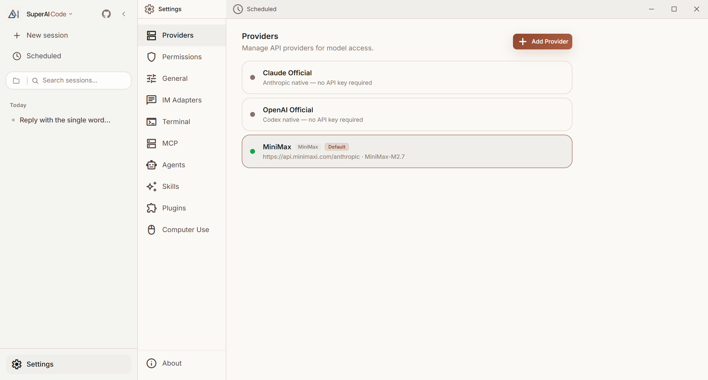

**设置 → 服务商** 管理模型来源，任一服务商设为 **Default** 后即被所有新会话使用；输入区的模型下拉可在当前服务商的模型间切换。

| 类型 | 说明 |
|------|------|
| **Claude Official** | Anthropic 官方账号登录（OAuth），无需 API Key |
| **OpenAI Official** | 通过本机 `codex` CLI 复用 ChatGPT 登录，无需 API Key（详见 [Codex 接入](../guide/codex.md)） |
| **预设服务商** | 「Add Provider」里选择 **DeepSeek / 智谱 GLM / Kimi / MiniMax**，填 API Key 即可，Base URL 与默认模型已预置 |
| **自定义** | 任意 Anthropic 兼容 Base URL + API Key + 模型名（[第三方模型使用指南](../guide/third-party-models.md)） |

配置项：名称、Base URL、API Key（密码输入）、API 格式（`anthropic` / `openai_chat` / `openai_responses`，非 Anthropic 格式由桌面端的本地代理转换）、模型映射（main / haiku / sonnet / opus）。**Test** 会真的发一条请求验证连通性和模型可用性。

服务商配置保存在 `~/.claude/superai/providers.json` + `settings.json`，**终端 UI `superai.exe` 与桌面端共用**——终端首次启动会用同一份列表引导你选择，会话中输入 `/provider` 可随时切换。

---

## 八、MCP 与职场连接器

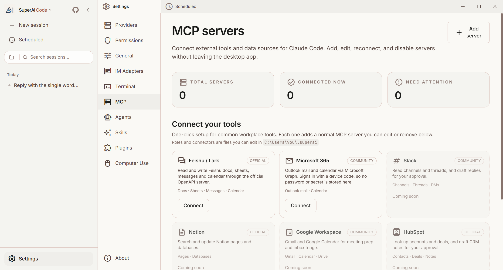

**设置 → MCP**：

- 顶部统计已配置 / 已连接 / 需要关注的 MCP 服务器，「Add server」手动添加任意 MCP 服务器
- **Connect your tools**：一键接入常用职场工具，每个连接器就是一条普通 MCP 配置，接入后可像其他服务器一样编辑或删除
  - **飞书 / Lark**（官方 OpenAPI 服务器：文档、表格、消息、日历）
  - **Microsoft 365**（Outlook 邮件与日历，设备码登录，本机不保存密码）
  - Slack / Notion / Google Workspace / HubSpot 等陆续开放
- 连接器与角色定义都是 `~/.superai/` 下的文件，可以自行增改

会话中输入 `/mcp` 查看当前可用的 MCP 工具。

---

## 九、IM 适配器接入

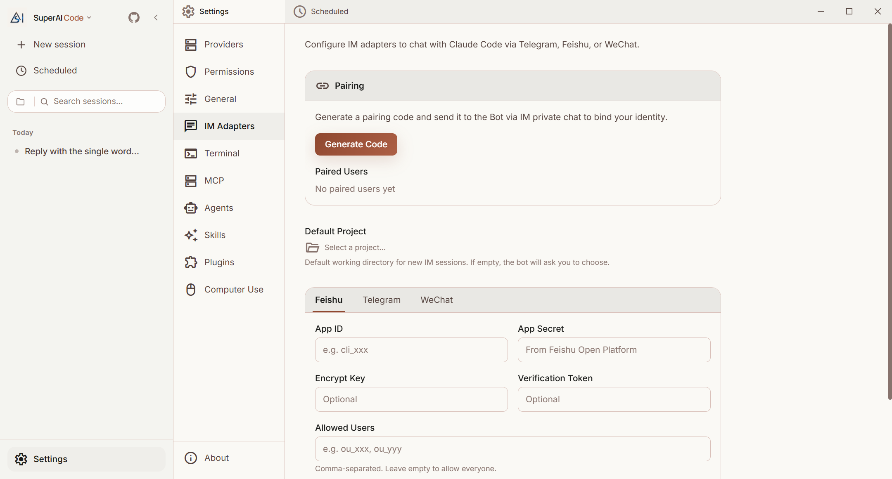

**设置 → IM 接入**，让同一套 Agent 通过 **飞书 / Telegram / 微信公众号** 远程使用。

### 配置步骤

1. 选择平台标签页并填入凭证：飞书 App ID / App Secret（Encrypt Key、Verification Token 可选）；Telegram Bot Token；微信公众号见 [IM 文档](../im/)
2. 「Default Project」选择 IM 会话默认使用的工作目录（留空则 Bot 会先问你）
3. 「Allowed Users」限制可用的用户（留空允许所有已配对用户）
4. 保存后适配器进程自动重启生效

### 用户配对

出于安全，IM 用户需要先配对：在 **Pairing** 区点「Generate Code」拿到一次性配对码（60 分钟内有效，排除易混淆字符），在 IM 里私聊发给 Bot 即绑定；同一用户 5 分钟内最多失败 5 次。

### IM 内操作

| 发送 | 效果 |
|------|------|
| 直接发文本 | 与 Agent 对话 |
| `/new [项目名]` 或「新会话」 | 开始新会话（模糊匹配项目） |
| `/projects` 或「项目列表」 | 查看最近项目 |
| `/stop` 或「停止」 | 停止当前生成 |

权限请求在 IM 中以按钮卡片出现（Telegram Inline Keyboard / 飞书交互卡片），点击即可审批。

---

## 十、定时任务

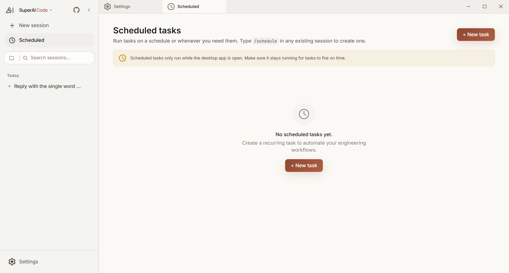

侧边栏 **Scheduled** 打开任务页；也可以在任一会话里输入 `/schedule` 把当前对话变成任务。

「New task」填写：名称、提示词、Cron 表达式（可视化选择星期）、模型、权限模式。任务行显示人性化的计划描述、启用开关、运行历史、手动运行和删除。Work 模式还提供周报、日程整理等模板。

> 定时任务只在桌面端运行时才会触发；需要保持应用打开。

---

## 十一、Computer Use

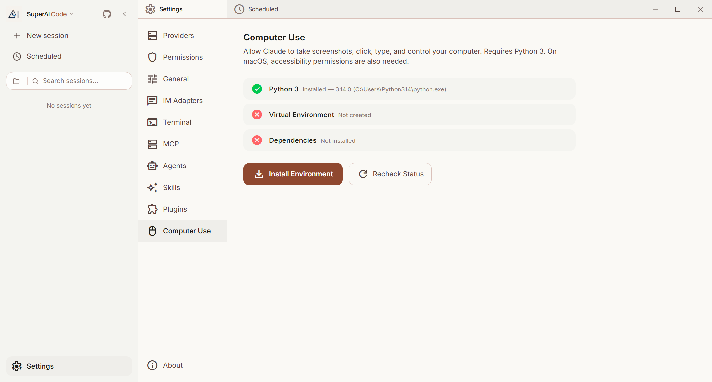

**设置 → Computer Use** 让 AI 截屏、点击、输入，直接操作桌面（Windows / macOS）。页面检查 Python 3、虚拟环境和依赖状态，「Install Environment」一键安装；macOS 还需要授予辅助功能权限。Windows 上另有「已授权应用」列表限制 AI 可以控制的程序，以及只读的界面元素定位工具（`read_ui_elements`）加速操作。详见 [Computer Use 功能指南](../features/computer-use.md)。

---

## 十二、应用更新

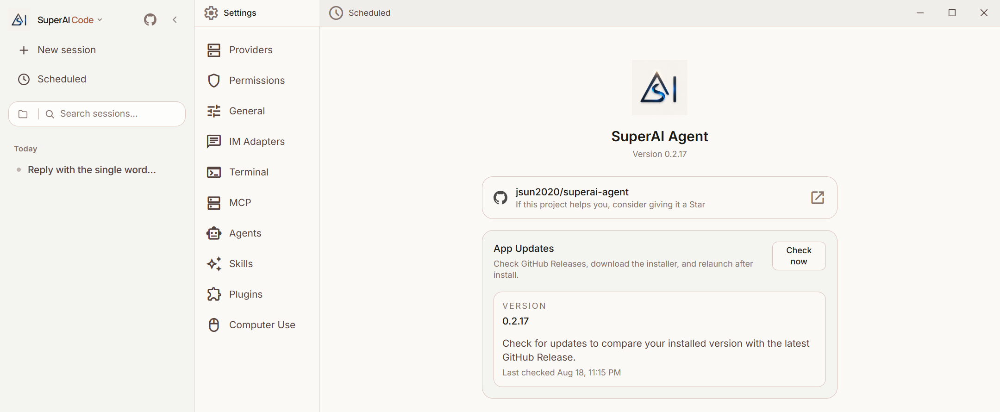

**设置 → 关于** 显示当前版本；「App Updates → Check now」对比 GitHub Release 的最新版本，有新版时下载安装包并在重启后完成更新。便携版用户也可以直接下载新的 zip 覆盖文件夹（桌面端与 `superai.exe` 共用一个版本号）。

---

## 十三、键盘快捷键速查

| 快捷键 | 功能 |
|--------|------|
| `Cmd/Ctrl + N` | 新建会话 |
| `Cmd/Ctrl + K` | 聚焦侧边栏搜索 |
| `Cmd/Ctrl + .` | 停止当前生成 |
| `Escape` | 关闭菜单 / 对话框 |
| `Enter` / `Shift + Enter` | 发送 / 换行 |
| `/` | 斜杠命令菜单 |
| `@` | 文件搜索菜单 |

---

## 十四、主题与语言

**设置 → 通用**：

- 主题：浅色 / 深色 / 跟随系统。浅色为奶油色背景（#FAF9F5），品牌色褐红（#8F482F）
- 语言：中文 / English，立即生效并保存在本地
